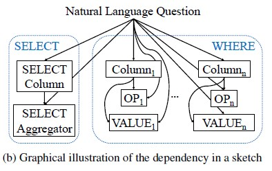
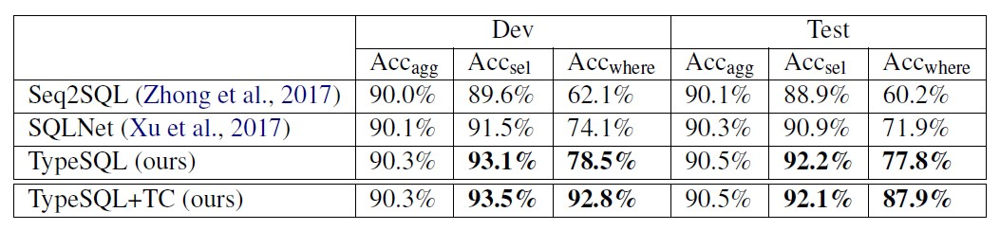

# db-systems-typesql-

 

Welcome to the db-systems-typesql- wiki!

  
   
  

  

`jjuhui`
Solarized dark                   |  Solarized Ocean
:-------------------------------:|:-------------------------:
  |          

<table style="width:100%">
  <tr>
    <th>  </th>
    <th>  </th>
    <th>  </th>
  </tr>
  <tr>
    <td>Jill</td>
    <td>Smith</td>
    <td>50</td>
  </tr>
  <tr>
    <td>Eve</td>
    <td>Jackson</td>
    <td>94</td>
  </tr>
</table>

* 
*
*

1. 

***

hhhhh

> kkk
>dsfsd
sdfs
